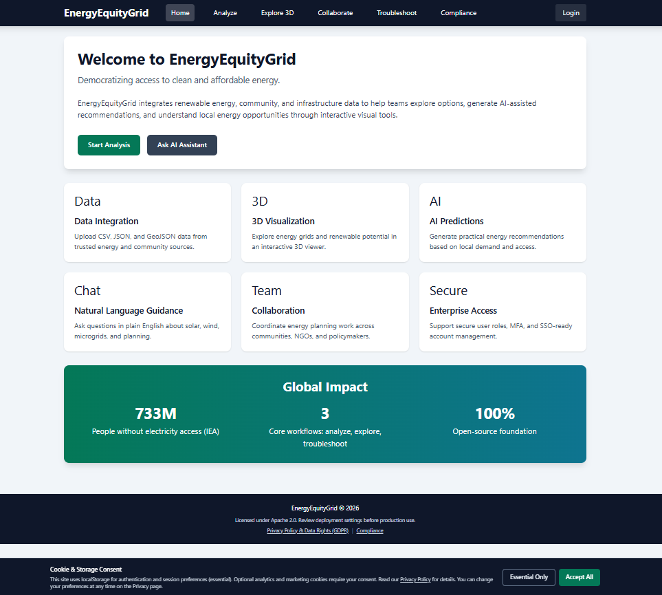
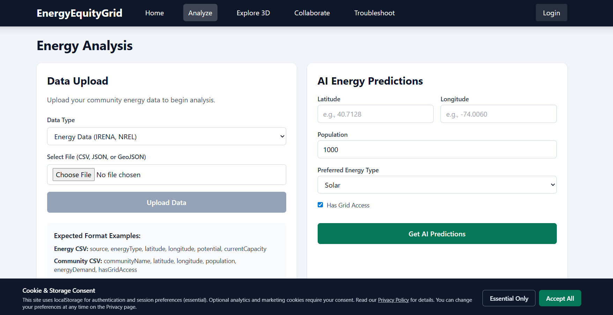
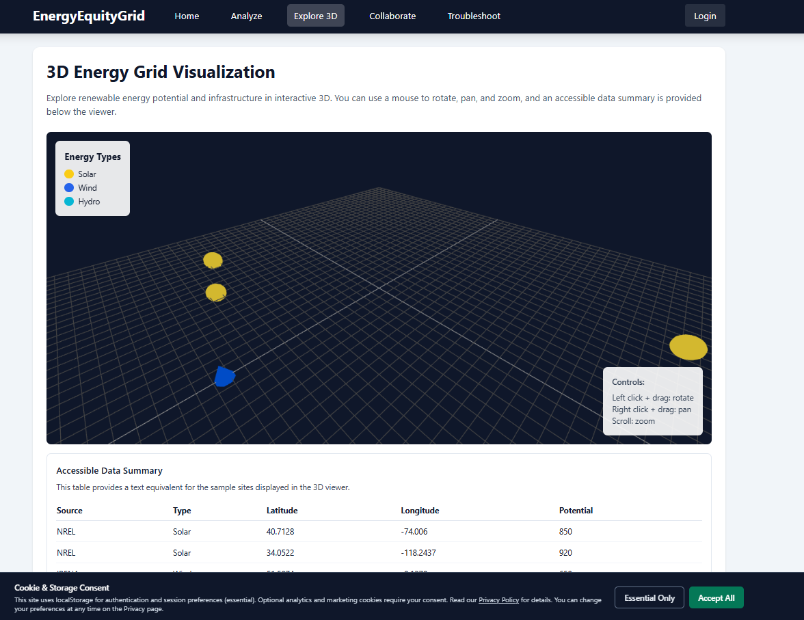
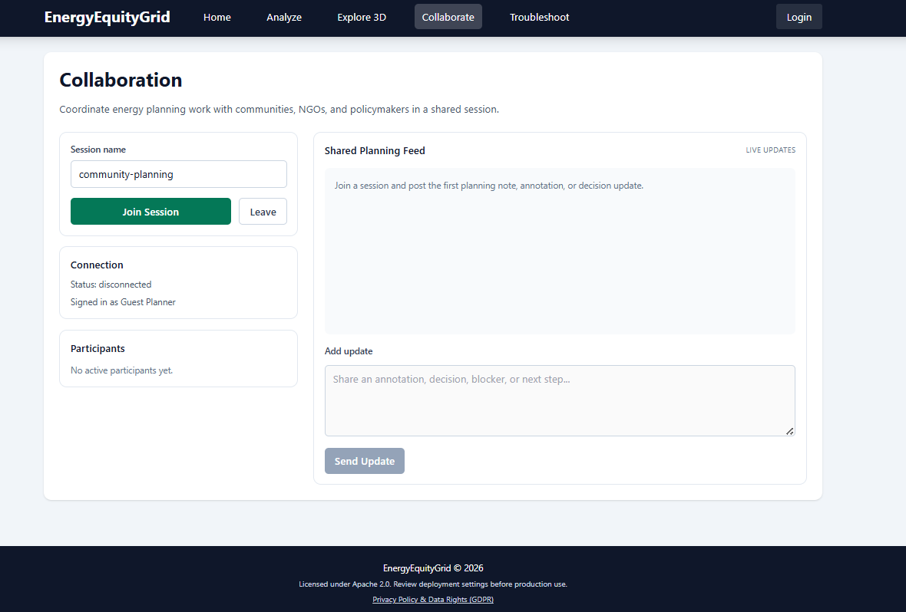

# EnergyEquityGrid

**Mission:** EnergyEquityGrid is free, inspectable software for energy-equity research and planning. It helps nonprofits, universities, researchers, students, and public-interest teams reduce software costs by giving them a self-hosted tool for uploading local energy data, exploring infrastructure context, generating planning estimates, and coordinating community energy work.






## The Problem

Energy access, clean-energy planning, and infrastructure research often require software that is expensive, closed, or difficult to adapt. Public-interest groups may need to compare renewable options, prepare community datasets, review infrastructure gaps, and document planning decisions, but commercial tools can put those workflows behind licensing fees, usage limits, vendor lock-in, or opaque hosted systems.

This is especially hard for:

- Nonprofits working with limited technology budgets.
- University labs and student teams that need reproducible tools for coursework or research.
- Researchers who need to inspect assumptions, data flows, and model behavior.
- Community and public-interest teams that need practical planning software without giving up control of their data.

EnergyEquityGrid addresses cost, access, workflow, privacy, and infrastructure concerns by providing a full-stack application that can be cloned, run locally, inspected, modified, and deployed by the organizations using it.

## What This Solves

EnergyEquityGrid gives users a working starting point for community energy analysis instead of a paid black-box platform.

It helps teams:

- Upload energy, community, and infrastructure datasets in CSV, JSON, or GeoJSON formats.
- Store and query uploaded datasets in PostgreSQL through Spring Boot services.
- Review nearby energy, community, and infrastructure records by location and radius.
- Generate planning estimates for energy demand and possible renewable solutions.
- Explore sample renewable-energy points in an interactive 3D viewer.
- Ask plain-language questions about solar, wind, microgrids, grid expansion, and troubleshooting.
- Coordinate shared planning notes in WebSocket collaboration rooms.
- Run the stack locally with Docker Compose instead of depending on a proprietary hosted service.
- Inspect the code, tests, migrations, API behavior, and deployment configuration.

The project is not a substitute for engineering review, utility interconnection studies, legal compliance review, or final capital planning. It is a practical research and planning tool that lowers the cost of early analysis and makes the software assumptions visible.

## Who It Is For

- **Nonprofits** that need low-cost tools for energy access, resilience, climate, housing, public health, or community infrastructure work.
- **Universities** that need a teachable, modifiable full-stack platform for clean-energy, data, policy, or civic technology courses.
- **Researchers** who need source-accessible software for experiments, prototypes, reproducible analysis, or grant-funded public-interest work.
- **Students** learning energy systems, data visualization, AI-assisted analysis, privacy-aware application design, or full-stack engineering.
- **Public-interest teams** working on community energy planning, infrastructure mapping, environmental justice, disaster resilience, or public service delivery.
- **Local governments, civic technologists, and community planners** who need a starting point they can adapt for local data and local constraints.

## Free / Low-Cost Use

This repository is licensed under the [Apache License 2.0](LICENSE).

Based on the license included in this repo, users may use, reproduce, modify, prepare derivative works, publicly display, publicly perform, sublicense, and distribute the software in source or object form under the Apache 2.0 terms. The license also includes a patent grant from contributors. If you redistribute the work or modified versions, you must comply with the license conditions, including providing a copy of the license, marking modified files, and retaining required copyright, patent, trademark, and attribution notices.

The license does not provide warranties, and the software is provided "AS IS."

For eligible nonprofits, universities, researchers, students, and public-interest groups, practical low-cost use can look like this:

```bash
git clone https://github.com/sekacorn/EnergyEquityGrid.git
cd EnergyEquityGrid
cp .env.example .env
docker-compose up --build
```

You can also fork the repository, change the code for your local workflow, and deploy your own copy, subject to the Apache 2.0 license terms.

No project contact email is listed in the repository files.

## What Is Included

Current repository contents include:

- **React frontend:** Vite, React Router, Tailwind CSS, reusable components, and pages for Home, Analyze, Explore 3D, Collaborate, Troubleshoot, Login, and Privacy.
- **Data upload workflow:** Frontend validation for CSV, JSON, and GeoJSON files up to 100 MB, with upload types for energy, community, and infrastructure data.
- **Data integration API:** A Spring Boot service that parses uploaded files, stores records with JPA repositories, and exposes an integrated location/radius query.
- **AI gateway:** Backend-owned `/api/ai/*` routes that forward prediction, query, and troubleshooting requests to internal Python services.
- **Energy prediction service:** A FastAPI and PyTorch service that accepts location, population, grid access, current demand, and energy preference inputs, then returns predicted demand, confidence, solution types, estimated capacity, rough cost ranges, and implementation time ranges.
- **Planning guidance service:** A FastAPI service with built-in guidance for solar, wind, microgrids, grid expansion, and common workflow troubleshooting. This is deterministic guidance logic, not an external hosted LLM integration.
- **3D visualization:** A Three.js/@react-three/fiber viewer with sample solar and wind points, orbit controls, markers scaled by potential, and a text table alternative.
- **Collaboration rooms:** WebSocket-based shared sessions with participants, live planning notes, annotations, reconnect behavior, and in-memory room state.
- **Authentication service:** Spring Boot user/session service with registration, login, JWT access and refresh tokens, role support, SSO-oriented endpoints, MFA setup/verification, account lockout, and audit logging.
- **Privacy and GDPR-oriented workflows:** Consent logging, privacy page, data access, JSON export, deletion request, optional consent updates, and a scheduled retention cleanup.
- **Database and migrations:** PostgreSQL schema managed by Flyway migrations, Redis configuration, and legacy reference schema under `database/postgres/schema.sql`.
- **Deployment files:** Dockerfiles for frontend, backend, predictor, and guidance services; Docker Compose orchestration; and an NGINX reverse proxy with API routing, rate limits, security headers, gzip, WebSocket proxying, and documented HTTPS configuration.
- **Compliance checklist:** A practical deployment checklist for GDPR, European Accessibility Act / EN 301 549, EU AI Act, NIS2, Cyber Resilience Act, Section 508, NIST SP 800-53, NIST Cybersecurity Framework, FedRAMP-readiness planning, and security review is available in [docs/compliance-checklist.md](docs/compliance-checklist.md).
- **Security and privacy notes:** Root-level [SECURITY.md](SECURITY.md) and [PRIVACY.md](PRIVACY.md) files explain vulnerability reporting, demo-data limits, production hardening, stored data categories, and deployer responsibilities.
- **Tests:** Python tests for AI services, Java tests for backend service behavior, frontend Vitest tests, and end-to-end style module tests.
- **Screenshots:** Five PNG screenshots showing the current UI and workflows.

## Current Status

EnergyEquityGrid is best treated as a **prototype and research starter kit**, not a turnkey production system.

What is working now:

- The repository contains a complete multi-service application structure.
- Docker Compose can build and run the intended service stack.
- Data upload, parsing, integrated data lookup, AI gateway, prediction, guidance, collaboration, auth, privacy, and deployment scaffolding are implemented in source.
- Tests exist for important backend, frontend, AI, and service-level behavior.

Important limitations:

- The predictor uses `model.pt` if present, but falls back to a randomly initialized PyTorch model when no trained model file exists. Outputs should be treated as demonstration or planning estimates unless a validated model is supplied.
- The natural-language service is a rules/knowledge-based FastAPI service. It does not currently call an external LLM provider.
- The 3D viewer ships with sample data by default; connecting uploaded/query data into the viewer is a likely next integration step.
- SSO configuration is present, but production identity-provider setup still needs deployment-specific configuration and validation.
- Security, privacy, and compliance features are included as implementation scaffolding, but any real deployment should receive a security, legal, and infrastructure review.

## Quick Start

### Prerequisites

- Docker and Docker Compose
- Git

For local service-by-service development, also install:

- Node.js 18+
- Java 17+
- Python 3.10+

### Run the Full Stack

```bash
git clone https://github.com/sekacorn/EnergyEquityGrid.git
cd EnergyEquityGrid
cp .env.example .env
```

Edit `.env` before non-demo use. At minimum, replace `POSTGRES_PASSWORD` and `JWT_SECRET` with deployment-specific values.

```bash
docker-compose up --build
```

### Service URLs

| Service | URL |
| --- | --- |
| Frontend | http://localhost:3000 |
| NGINX gateway | http://localhost:8080 |
| Energy integrator API | http://localhost:8081 |
| User session API | http://localhost:8082 |
| AI prediction service | http://localhost:8083 |
| Planning guidance service | http://localhost:8084 |

## Local Development

### Frontend

```bash
cd frontend
npm install
npm run dev
```

### Backend Services

```bash
cd backend/energy-integrator
mvn spring-boot:run
```

```bash
cd backend/user-session
mvn spring-boot:run
```

### Python Services

```bash
cd ai-model
pip install -r requirements.txt
python -m uvicorn energy_predictor:app --host 0.0.0.0 --port 8083
python -m uvicorn llm_service:app --host 0.0.0.0 --port 8084
```

## Configuration

Start from `.env.example`. Key settings include:

| Variable | Purpose |
| --- | --- |
| `POSTGRES_DB` | PostgreSQL database name |
| `POSTGRES_USER` | PostgreSQL username |
| `POSTGRES_PASSWORD` | PostgreSQL password |
| `JWT_SECRET` | Shared JWT signing secret; use a long random value |
| `JWT_EXPIRATION` | Access token lifetime |
| `JWT_REFRESH_EXPIRATION` | Refresh token lifetime |
| `ALLOWED_ORIGINS` | CORS allowed origins |
| `VITE_API_AI` | Frontend AI gateway base URL |
| `VITE_API_AUTH` | Frontend auth API base URL |
| `VITE_API_INTEGRATOR` | Frontend data API base URL |
| `VITE_API_SESSION` | Frontend session service base URL |
| `VITE_WS_COLLAB` | Collaboration WebSocket URL |
| `AI_PREDICTOR_URL` | Backend URL for the prediction service |
| `AI_LLM_URL` | Backend URL for the planning guidance service |
| `GOOGLE_CLIENT_ID`, `AZURE_CLIENT_ID`, `OKTA_CLIENT_ID` | Optional SSO provider configuration |

## Testing

### AI Services

```bash
pytest tests/ai/test_energy_predictor.py -v
pytest tests/ai/test_llm_service.py -v
pytest tests/ai/test_cors.py -v
```

### Backend

```bash
cd backend/energy-integrator
mvn test
```

```bash
cd backend/user-session
mvn test
```

### Frontend

```bash
cd frontend
npm test
```

### End-to-End Style Checks

```bash
pytest tests/e2e/test_services.py -v
```

## Project Structure

```text
EnergyEquityGrid/
  ai-model/                    Python FastAPI prediction and guidance services
  backend/
    energy-integrator/         Spring Boot data integration, AI gateway, WebSocket service
    user-session/              Spring Boot auth, sessions, MFA, SSO, consent, GDPR workflows
  database/                    PostgreSQL reference schema and Redis config
  docs/                        Compliance checklist and deployment review notes
  frontend/                    React/Vite UI
  infra/nginx/                 Reverse proxy and security-header configuration
  tests/                       AI, backend, frontend, and service-level tests
  docker-compose.yml           Local full-stack orchestration
  .env.example                 Environment template
  screenshot-*.png             UI screenshots
```

## License

Licensed under the [Apache License 2.0](LICENSE).
